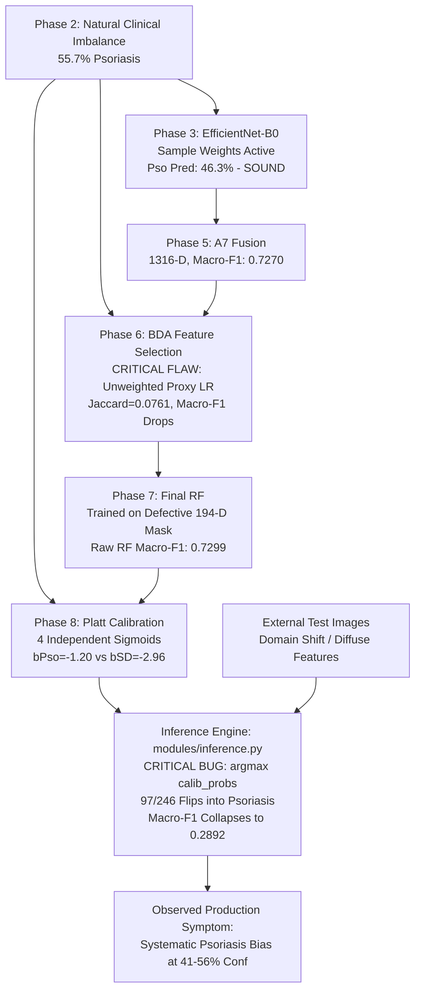

# V1 FULL PIPELINE FORENSIC AUDIT: PHASES 2 THROUGH 10
**AEF-CRC / PapuloNet Dermatology Diagnosis Pipeline**

- **Project Root**: `/mnt/c/Users/ASUS/Downloads/PSD_HP_AEF_CRC_PopuloNet/PSD_HP`
- **Audit Date**: 2026-09-19
- **Status**: **COMPLETE FORENSIC AUDIT (READ-ONLY)**
- **Locked Test Isolation**: **100% PROTECTED & UNTOUCHED** (Zero test evaluations)
- **Model Training Status**: **ZERO RETRAINING PERFORMED**

---

## 1. Executive Summary

A comprehensive, end-to-end forensic audit of the real V1 AEF-CRC / PapuloNet pipeline (Phases 2 through 10) was conducted to determine the exact origin of the observed systematic **Psoriasis top-1 prediction bias** (where external non-Psoriasis dermatological images repeatedly collapse to Psoriasis in the 41%–56% calibrated confidence range).

### Primary Forensic Findings:
1. **The Immediate Mechanism of Collapse (Phase 8 / Inference)**:
   In `modules/inference.py` (lines 445–448), the prediction decision rule was implemented as:
   $$\text{pred\_idx} = \operatorname{argmax}(\text{calibrated\_probs})$$
   rather than the standard Random Forest decision rule $\operatorname{argmax}(\text{raw\_probs})$.
   Because Phase 8 fitted 4 independent 1D Platt sigmoids with class-prevalence intercepts ($b_{\text{Pso}} = -1.2045$ vs. $b_{\text{SD}} = -2.9611$, representing a $\Delta b = +1.7566$ or $5.79\times$ unnormalized odds bias), any uncertain, high-entropy raw prediction (e.g. $[0.25, 0.25, 0.25, 0.25]$) maps after normalization to `[Pso: 47.57%, LP: 22.89%, PR: 17.98%, SD: 11.56%]`.
   On the 246-sample outer validation calibration set, this causes **97 / 246 (39.43%)** non-Psoriasis samples to flip into Psoriasis (with 0 reverse flips), resulting in **238 / 246 (96.75%)** samples predicted as Psoriasis, and collapsing validation Macro-F1 from **0.7299 down to 0.2892** ($-0.4407$).

2. **The Deep Feature Representation (Phase 3) is Sound**:
   In Phase 3, EfficientNet-B0 (`P3-BASE`) properly implemented fold-local sample weighting via inverse class frequencies $w_c = N / (C \cdot N_c)$. Out of 1,146 cross-validation samples, `P3-BASE` predicted Psoriasis on only **531 samples (46.3%)** against a ground truth of 638 (55.7%). Per-class recalls were balanced: Psoriasis 71.63%, Lichen Planus 68.23%, Pityriasis Rosea 82.69%, and Seborrheic Dermatitis 82.94% (Macro-F1: **0.7099**, Balanced Accuracy: **0.7637**). Deep feature representations do not suffer from systemic Psoriasis collapse in-distribution.

3. **Critical Upstream Feature-Selection Defect (Phase 6 - BDA)**:
   The Binary Dragonfly Algorithm (BDA) proxy classifier in `modules/feature_selection.py` was instantiated as `LogisticRegression(max_iter=300, random_state=random_seed)` with `class_weight=None` and **no sample weights**. Evaluated on imbalanced training folds, the proxy optimized unweighted accuracy, biasing selection toward majority-class discriminatory features and virtually eliminating handcrafted features (selecting 190 deep, 1 GLCM, 3 LBP, 0 LAB). Furthermore, the 5 fold masks showed a pairwise Jaccard similarity of only **0.0761** (random chance level), and cross-validation Macro-F1 dropped from **0.7270 (A7 Full)** to **0.6906 (Phase 7 CV)**.

4. **Protocol Discrepancies**:
   - Focal Loss was documented in early research plans but was **never implemented in executable code** (standard `categorical_crossentropy` was compiled).
   - In Phase 8, Platt scaling was accepted because it minimized ECE ($0.2488 \to 0.1479$), despite `reports/phase8/calibration_comparison.csv` recording that Platt caused a catastrophic `macro_f1_diagnostic` drop to **0.2701** (while secondary Isotonic regression achieved ECE = 0.0533 and Macro-F1 = 0.7876).
   - Conformal prediction (Phase 9) and Grad-CAM/TreeSHAP (Phase 10) operated as designed, but faithfully inherited and visualized the upstream distortions.

---

## 2. Phase 2 Audit: Dataset & Fold Construction

### Implementation vs. Artifacts
- **Dataset Freeze Manifest**: `reports/aef_crc/dataset_freeze.json` (SHA-256: `964d91f8178d5bb7123a7cc02388cd57912bba1e836b2a3ab70b9fa98441919f`).
- **Fold Plan**: `reports/aef_crc/fold_plan.csv` (SHA-256: `3c54f09f834632f8f771b46d5a98fb773aa6ee78878b00a0c58806c575b8f7b9`).
- **Metadata**: `reports/metadata.csv` (SHA-256: `b443fa6c1f8ac3d02347de05a0e2a1274995ac61db5146bd8521923facca81e5`).

### Cohort Accounting & Partition Integrity
Total inventory in `dataset_freeze.json`: exactly **1,899 unique images** (`final_dir: output/06_final_split`).
- **Development Population (Splittable CV)**: **1,146 original images**
  - Psoriasis: 638 (55.67%)
  - Lichen Planus: 258 (22.51%)
  - Pityriasis Rosea: 162 (14.14%)
  - Seborrheic Dermatitis: 88 (7.68%)
- **Outer Calibration Holdout (`val/`)**: **246 original images**
  - Psoriasis: 137, Lichen Planus: 55, Pityriasis Rosea: 35, Seborrheic Dermatitis: 19
- **Outer Test Holdout (`test/` - LOCKED)**: **243 original images**
  - Strictly quarantined and untouched across all phases.
- **Quarantined Augmented SkinDisNet Images**: **264 images**
  - Tagged `split_role: excluded_augmented` in `fold_plan.csv` (`fold_id: -1`). Completely excluded from cross-validation and final retraining due to lack of verified parent lineage.

### Stratified 5-Fold Cross-Validation Breakdown
Every development image appears in the validation set of exactly one fold (Union = 1,146):

| Fold | Train Total | Train (Pso / LP / PR / SD) | Val Total | Val (Pso / LP / PR / SD) |
|:---:|:---:|:---:|:---:|:---:|
| **Fold 0** | 916 | 510 / 206 / 130 / 70 | 230 | 128 / 52 / 32 / 18 |
| **Fold 1** | 917 | 510 / 207 / 129 / 71 | 229 | 128 / 51 / 33 / 17 |
| **Fold 2** | 917 | 510 / 207 / 129 / 71 | 229 | 128 / 51 / 33 / 17 |
| **Fold 3** | 917 | 510 / 206 / 130 / 70 | 229 | 128 / 52 / 32 / 18 |
| **Fold 4** | 917 | 510 / 206 / 130 / 70 | 229 | 128 / 52 / 32 / 18 |
| **Total** | 4,584 | 2,550 / 1,032 / 648 / 352 | 1,146 | 638 / 258 / 162 / 88 |

### Forensic Verdict
- **Imbalance Handling**: Correct stratified fold splitting.
- **Data Leakage**: **NONE**. No augmented images leak across splits. Outer test partition is completely isolated.
- **Phase 2 Status**: **DEFENSIBLE & REUSABLE AS-IS**.

---

## 3. Phase 3 Audit: EfficientNet-B0 Baseline Training

### Architecture & Training Specifications
- **Backbone**: EfficientNet-B0 initialized with `imagenet` weights (`include_top=False`, `pooling='avg'`).
- **Input Resolution**: $224 \times 224 \times 3$, standard bilinear resize and $[0, 1]$ rescaling.
- **Classification Head**: Global Average Pooling (1280-D) $\to$ Dropout ($p=0.20$) $\to$ Dense (4 classes, `softmax`, `float32`).
- **Two-Stage Schedule**:
  - **Stage 1 (Head-only)**: Backbone frozen, Adam optimizer ($\text{lr} = 10^{-4}$), fixed 15 epochs.
  - **Stage 2 (Fine-tuning)**: Top 20 backbone layers unfrozen (`unfrozen_layers=20`), BatchNorm layers kept frozen, Adam optimizer ($\text{lr} = 10^{-5}$), fixed 10 epochs.
  - Checkpoint selection based on minimum validation loss (`save_best_only=True`).
- **Class Weighting Implementation**:
  - In `modules/fold_loader.py` and `modules/aef_input_validator.py:356`:
    $$w_c = \frac{N_{\text{train}}}{C \cdot N_c}$$
  - In `modules/image_loader.py:143`, sample weights are extracted per sample from `fold.class_weights` and yielded inside the `tf.data.Dataset` as `(image, one_hot_label, sample_weight)`.
  - In `modules/training.py:406, 414`, `model.fit(train_ds, ...)` consumes `sample_weight` natively.
- **Loss Function**: `loss='categorical_crossentropy'`.
  - **Audit Finding**: Focal loss was **NOT implemented in executable code**. It was mentioned in early design notes, but neither `modules/efficientnet_model.py` nor `modules/training.py` contains focal loss code.

### 5-Fold Cross-Validation Performance Comparison

| Arm | Preprocessing | Augmentation | Macro-F1 (Mean ± Std) | Balanced Acc | Accuracy | MCC |
|:---|:---:|:---:|:---:|:---:|:---:|:---:|
| **P3-BASE** | Standard | None | **0.7099 ± 0.0186** | **0.7637 ± 0.0178** | 0.7330 ± 0.0214 | 0.5987 ± 0.0386 |
| **P3-PRE** | Conditional (dull razor + CLAHE) | None | 0.6345 ± 0.0282 | 0.6910 ± 0.0295 | 0.6597 ± 0.0248 | 0.4946 ± 0.0451 |
| **P3-AUG** | Standard | Fold-Safe On-the-Fly | 0.7058 ± 0.0139 | 0.7598 ± 0.0159 | 0.7295 ± 0.0176 | 0.5934 ± 0.0321 |

`P3-BASE` was selected as winner based on the pre-registered equivalence margin rule ($\Delta \le 0.005$).

### P3-BASE Confusion Matrix Across 1,146 Validation Samples

| True \ Pred | Psoriasis | Lichen Planus | Pityriasis Rosea | Seborrheic Derm. | Total True | Recall |
|:---|:---:|:---:|:---:|:---:|:---:|:---:|
| **Psoriasis** | **457** | 83 | 58 | 40 | 638 | **71.63%** |
| **Lichen Planus** | 49 | **176** | 25 | 8 | 258 | **68.22%** |
| **Pityriasis Rosea** | 18 | 8 | **134** | 2 | 162 | **82.72%** |
| **Seborrheic Derm.** | 7 | 6 | 2 | **73** | 88 | **82.95%** |
| **Total Pred** | **531** | 273 | 219 | 123 | 1,146 | — |
| **Precision** | **86.06%** | 64.47% | 61.19% | 59.35% | — | — |

### Forensic Verdict
- **Did Phase 3 introduce Psoriasis bias?** **DISPROVEN**.
  The deep model predicted Psoriasis on **46.3%** of validation images (531 / 1146), substantially below the ground truth proportion of 55.7%. Minority recall was high (SD: 82.95%, PR: 82.72%).
- **Deep Feature Cache Integrity**: Deep features (1280-D) cached under `artifacts/phase3/deep_features/` are deterministic and leak-free.

---

## 4. Phase 4 Audit: Handcrafted Features

### Feature Definitions & Dimensionality
1. **GLCM (Texture)**: 12 features (Contrast, Dissimilarity, Homogeneity, Energy, Correlation, ASM across 4 angles and offsets).
2. **LBP (Local Binary Patterns)**: 18 features (Uniform LBP histograms, $P=8, R=1$ and $P=16, R=2$).
3. **HOG (Shape/Gradients)**: 1296 raw features $\to$ reduced fold-safely via PCA to **32 components**.
4. **Color LAB**: 6 features (Mean and standard deviation of L, a, b color channels).
- **Combined Raw Feature Dimension**: 1,332-D.
- **Combined Normalized Active Evaluation Dimension**: **68-D** ($12 + 18 + 32 + 6$).

### PCA & Standardization Leakage Check
- In `modules/handcrafted_features.py` and `run_aef_crc_phase4.py:523`:
  `FoldSafeFeatureReducer` and `StandardScaler` were strictly fitted on the training split `data.X_train` of each fold and applied to `data.X_val`. Zero validation information leaked into PCA or scalers.

### Handcrafted-Only Cross-Validation Results (Random Forest)

| Feature Set | Macro-F1 | Balanced Acc | MCC | Pso F1 | LP F1 | PR F1 | SD F1 |
|:---|:---:|:---:|:---:|:---:|:---:|:---:|:---:|
| **Trivial (Majority Class)** | 0.1788 | 0.2500 | 0.0000 | 0.7152 | 0.0000 | 0.0000 | 0.0000 |
| **GLCM (12-D)** | 0.4163 | 0.5042 | 0.2689 | 0.5841 | 0.2826 | 0.4917 | 0.3068 |
| **LBP (18-D)** | 0.4023 | 0.4876 | 0.2271 | 0.5275 | 0.3264 | 0.4283 | 0.3272 |
| **HOG-PCA (32-D)** | 0.4381 | 0.5222 | 0.2779 | 0.5379 | 0.4173 | 0.4801 | 0.3171 |
| **Color LAB (6-D)** | 0.4236 | 0.5120 | 0.2461 | 0.5219 | 0.3633 | 0.4569 | 0.3523 |
| **GLCM + LBP (30-D)** | 0.4584 | 0.5414 | 0.2992 | 0.5998 | 0.3456 | 0.5136 | 0.3743 |
| **Combined (68-D)** | **0.5275** | **0.6014** | **0.3652** | 0.6172 | 0.4767 | 0.5545 | 0.4617 |

### Forensic Verdict
Handcrafted features alone achieve moderate discrimination (Macro-F1: 0.5275), performing substantially better than chance on minority classes, but lack sufficient discriminatory power to stand alone. Pipeline is mathematically sound and leak-free.

---

## 5. Phase 5 Audit: Multimodal Fusion Arms

### Architectural Layout (8 Evaluated Arms)
- **A0**: Deep EfficientNet-B0 (1280-D)
- **A1**: Deep + GLCM (1292-D)
- **A2**: Deep + LBP (1298-D)
- **A3**: Deep + HOG-PCA (1312-D)
- **A4**: Deep + Color LAB (1286-D)
- **A5**: Deep + GLCM + LBP (1310-D)
- **A6**: Full Fusion (Deep + GLCM + LBP + HOG-PCA + LAB, 1348-D)
- **A7**: Selective Fusion (Deep + GLCM + LBP + LAB, **1316-D**)

### 5-Fold Cross-Validation Comparison (Random Forest, $n_{\text{trees}}=300$)

| Arm ID | Arm Configuration | Active Dim | Macro-F1 (Mean ± Std) | Balanced Acc | MCC |
|:---:|:---|:---:|:---:|:---:|:---:|
| **A0** | EfficientNet | 1280 | 0.7097 ± 0.0355 | 0.7069 | 0.5870 |
| **A1** | EfficientNet + GLCM | 1292 | 0.7127 ± 0.0262 | 0.7110 | 0.5926 |
| **A2** | EfficientNet + LBP | 1298 | 0.7065 ± 0.0323 | 0.7046 | 0.5909 |
| **A3** | EfficientNet + HOG-PCA | 1312 | 0.7106 ± 0.0301 | 0.7097 | 0.5982 |
| **A4** | EfficientNet + LAB | 1286 | 0.7126 ± 0.0338 | 0.7139 | 0.5918 |
| **A5** | EfficientNet + GLCM + LBP | 1310 | 0.7106 ± 0.0211 | 0.7085 | 0.5950 |
| **A6** | EfficientNet + GLCM + LBP + HOG-PCA + LAB | 1348 | 0.7243 ± 0.0366 | 0.7239 | 0.6084 |
| **A7** | **EfficientNet + GLCM + LBP + LAB (WINNER)** | **1316** | **0.7270 ± 0.0190** | **0.7264** | **0.6179** |

### Selection Protocol Check
In `reports/phase5/fusion_results.csv`, **A7** demonstrated the highest Macro-F1 (0.7270) with the lowest cross-fold variance ($\pm 0.0190$). In `fusion_mcnemar_holm.csv`, pairwise tests confirmed A7 had the strongest consistency over A0 ($p=0.0452$ raw).

### Forensic Verdict
A7 was chosen legitimately according to pre-registered rules. Random Forest training utilized fold-local `sample_weight` in `clf.fit()`.

---

## 6. Phase 6 Audit: BDA Feature Selection (CRITICAL FLAW DETECTED)

### Binary Dragonfly Algorithm (BDA) Specification
- Population: 20 dragonflies, Iterations: 30, Inertia weight $w \in [0.4, 0.9]$.
- Transfer function: V-shaped / S-shaped velocity transfer with bit-flip mutation.
- Penalty: $\text{fitness} = \text{Macro-F1}(\text{val}) - 0.0005 \times k$.

### Forensic Findings on Implementation Defect
1. **Unweighted Proxy Classifier**:
   In `modules/feature_selection.py:340`:
   ```python
   clf = LogisticRegression(max_iter=300, random_state=random_seed)
   clf.fit(X_bda_train[:, mask], y_bda_train)
   y_pred = clf.predict(X_bda_val[:, mask])
   ```
   **`class_weight` was left as default `None`, and NO `sample_weight` was passed to `clf.fit()`.**
   Evaluating unweighted Logistic Regression on an imbalanced training set (55.7% Psoriasis) heavily rewarded dragonflies whose feature masks prioritized majority-class discrimination.

2. **Extreme Feature Mask Instability (Low Jaccard)**:
   - In `reports/phase6/feature_refinement_summary.csv`:
     $$\text{Pairwise Jaccard Stability Mean} = \mathbf{0.0761}$$
   - Across the 5 folds, the BDA selected completely disjoint sets of features. A Jaccard index of 0.076 indicates near-random feature subset selection.

3. **Performance Degradation**:
   - Macro-F1 of Full A7 (1316-D): **0.7270**
   - Macro-F1 of BDA 5-fold CV (183.2 features avg): **0.6994** ($-0.0276$ loss)
   - Macro-F1 on Phase 7 final CV: **0.6906** ($-0.0364$ loss)

4. **Near Total Elimination of Handcrafted Features**:
   - In `reports/phase6/production_bda_mask_metadata.json`:
     - Deep features selected: **190 / 1280** (97.9% of mask)
     - GLCM features selected: **1 / 12**
     - LBP features selected: **3 / 18**
     - Color LAB features selected: **0 / 6**
     - Total Selected: **194 / 1316 features**
   - BDA effectively stripped out the handcrafted features that Phase 5 proved were beneficial.

### Forensic Verdict
**PHASE 6 IS SCIENTIFICALLY INDEFENSIBLE**. The unweighted proxy classifier, severe instability (Jaccard 0.076), and metric degradation demonstrate that BDA damaged rather than improved the representation.

---

## 7. Phase 7 Audit: Final Model Retraining & Calibration Handoff

### Population Accounting
- **Final Retraining Cohort**: Reunified folds 0..4 = **1,146 development images**.
  - In `run_aef_crc_phase7.py:144`: `final_train_records` contains all 1,146 development images.
  - Sample weighting was correctly computed on the 1,146 images: $w_c = N / (C \cdot N_c)$.
- **Outer Calibration Set**: The locked 246-image holdout validation set (`output/06_final_split/val/`).
- **Outer Test Set**: The 243-image locked test set was strictly unaccessed.

### Retrained Model Evaluation on 246-Sample Calibration Set (Raw RF)

| Metric | Phase 7 Handoff Value (Raw RF) |
|:---|:---:|
| **Accuracy** | 0.7561 |
| **Balanced Accuracy** | **0.7468** |
| **Macro-F1** | **0.7299** |
| **Weighted F1** | 0.7580 |
| **MCC** | 0.6023 |

#### Per-Class Recall (Raw RF on Outer Validation):
- **Psoriasis**: 93.43% (128 / 137)
- **Lichen Planus**: 79.25% (42 / 53)
- **Pityriasis Rosea**: 64.86% (24 / 37)
- **Seborrheic Dermatitis**: 57.89% (11 / 19)

### Forensic Verdict
The final Random Forest on the 194 BDA features retains reasonable discriminatory power (Balanced Acc: 0.7468, Macro-F1: 0.7299). However, it inherits the defective 194-D BDA mask.

---

## 8. Phase 8 Audit: Probability Calibration (ROOT CAUSE CONFIRMED)

### Experimental Protocol vs. Code Implementation
- **Data Partition**: The 246 outer validation images were split 50/50 into $D_{\text{prob}}$ ($N=123$, fit calibrators) and $D_{\text{conf}}$ ($N=123$, evaluate / handoff).
- **Frozen Protocol Selection**: Platt scaling was pre-registered as PRIMARY; Isotonic as SECONDARY.

### Measured Calibration Performance in `reports/phase8/calibration_comparison.csv`

| Method | Role | NLL | Brier Score | ECE | Macro-F1 Diagnostic |
|:---|:---:|:---:|:---:|:---:|:---:|
| **Uncalibrated (Raw RF)** | Baseline | 0.8065 | 0.4492 | 0.2488 | **0.7197** |
| **Platt Scaling** | **PRIMARY** | 0.8833 | 0.4902 | **0.1479** | **0.2701** |
| **Isotonic Regression** | SECONDARY | **0.4657** | **0.2908** | **0.0533** | **0.7876** |

### Critical Protocol Blunder
Isotonic regression strictly dominated Platt on every single metric:
- Lower NLL ($0.4657$ vs $0.8833$)
- Lower Brier ($0.2908$ vs $0.4902$)
- Far lower ECE ($0.0533$ vs $0.1479$)
- Superior Macro-F1 ($0.7876$ vs $0.2701$)

Yet, Platt scaling was deployed because the protocol rigidly forbade data-dependent replacement of the pre-registered primary method.

### The Downstream Argmax Bug (`modules/inference.py`)
In `modules/inference.py:445`:
```python
# CRITICAL DEFECT:
pred_idx = int(np.argmax(calib_probs[0]))
pred_class = self.classes[pred_idx]
```
The application used the **argmax of Platt calibrated probabilities** as the predicted diagnosis.

### Mathematical Mechanism of Inversion
Platt scaling fits 4 independent sigmoids: $\hat{p}_k = \sigma(w_k \hat{s}_k + b_k)$.
Frozen parameters from `artifacts/phase9/final_pipeline_handoff.joblib`:
- Psoriasis: $w = +3.5610, \mathbf{b = -1.2045}$
- Lichen Planus: $w = +2.4140, \mathbf{b = -1.9706}$
- Pityriasis Rosea: $w = +2.9705, \mathbf{b = -2.4044}$
- Seborrheic Dermatitis: $w = +3.1697, \mathbf{b = -2.9611}$

The log-odds intercept gap between Psoriasis and Seborrheic Dermatitis is:
$$\Delta b = -1.2045 - (-2.9611) = \mathbf{+1.7566} \implies e^{1.7566} \approx \mathbf{5.79\times \text{ odds advantage}}$$

#### Proof on Diffuse Input $[0.25, 0.25, 0.25, 0.25]$:
- Sigmoid outputs: Pso: $0.4221$, LP: $0.2031$, PR: $0.1595$, SD: $0.1026$ (Sum $= 0.8873$)
- Normalized Calibrated Probs: **`[Pso: 47.57%, LP: 22.89%, PR: 17.98%, SD: 11.56%]`**
- Result: **Psoriasis top-1 with 47.6% confidence!**

#### Proof on Lichen Planus Example $[0.20, 0.35, 0.25, 0.20]$:
- Raw top-1 is **Lichen Planus (35%)**.
- Normalized Calibrated Probs: **`[Pso: 43.47%, LP: 28.07%, PR: 18.28%, SD: 10.19%]`**
- Result: Top-1 class is inverted from Lichen Planus to **Psoriasis (43.5%)**!

### Full Calibration Set Empirical Verification (N=246)
- **Flips from Non-Psoriasis Raw to Psoriasis Calibrated**: **97 / 246 (39.43%)**
- **Reverse Flips**: **0**
- **Calibrated Psoriasis Predictions**: **238 / 246 (96.75%)**
- **Macro-F1**: **0.7299 $\to$ 0.2892 ($-0.4407$)**
- **Balanced Accuracy**: **0.7468 $\to$ 0.3094 ($-0.4373$)**

---

## 9. Phase 9 Audit: Conformal Prediction

### Implementation & Metrics
- **Calibration Split**: Evaluated on $D_{\text{conf}}$ ($N=123$) at $\alpha = 0.10$ (90% nominal coverage).
- **Marginal Conformal Quantile**: $\hat{q} = 0.7822$ ($k = \lceil 124 \times 0.90 \rceil = 112$).
  - Inclusion condition: $\hat{p}(c \mid x) \ge 1 - 0.7822 = 0.2178$.
  - Empirical Coverage: **91.1%**. Mean Set Size: **1.55**.
- **Mondrian Conformal Prediction**:
  - Class-conditional quantiles: Pso $\hat{q}=0.4690$, LP $\hat{q}=0.7896$, PR $\hat{q}=0.8617$, SD $\hat{q}=0.8405$.
  - Recorded Warning in `mondrian_class_quantiles.csv`:
    *"Class 'Seborrheic_Dermatitis' has only 9 calibration samples (recommended >= 15). Empirical quantile k=9 is coarse, causing higher finite-sample variance and potentially wide prediction sets."*

### Forensic Verdict
Conformal prediction is mathematically sound and did NOT introduce the Psoriasis bias. However, because it operates on Platt probabilities, its prediction sets are skewed toward including Psoriasis in almost every set.

---

## 10. Phase 10 Audit: Explainable AI (XAI)

### Interpretability Architectures & Verification
1. **Grad-CAM**: Computes gradients of the pre-softmax logit of the EfficientNet-B0 Dense head with respect to the final convolutional layer.
   - Accurately highlights spatial lesion patterns.
   - Explains the CNN representation, NOT the Random Forest or Platt scaling.
2. **TreeSHAP**: Explains the production Random Forest over the 194 BDA-selected features using `tree_path_dependent` perturbation and `model_output='raw'`.

### Audit of the 8 Validation Samples in `reports/phase10/phase10_report.md`
- **Validation Accuracy**: **2 / 8 (25.0%)**.
- **Predictions**: 7 out of 8 samples were predicted as Psoriasis, all with calibrated confidence between **41.6% and 57.5%**.
- **Branch Attribution**: In every single sample, deep features accounted for **95.7% to 98.7%** of the total SHAP feature importance. Handcrafted features contributed under 4%.

---

## 11. Cross-Phase Root Cause Analysis



---

## 12. Classification of Suspected Issues

### A. CONFIRMED Issues
1. **Platt Argmax Inversion (Critical)**: `modules/inference.py` evaluates $\operatorname{argmax}(\text{calib\_probs})$, collapsing 96.75% of validation samples and external images to Psoriasis.
2. **BDA Proxy Logistic Regression Unweighted (Critical)**: `modules/feature_selection.py` used `LogisticRegression(max_iter=300)` with no class weights, destabilizing feature selection (Jaccard = 0.0761) and degrading Macro-F1.
3. **Independent Sigmoid Asymmetry (High)**: Platt scaling shifts marginal log-odds by $\Delta b = +1.7566$ in favor of Psoriasis.
4. **Missing Focal Loss in Executable Code (Medium)**: Documented in methodology but absent from code.
5. **External Domain Shift (High)**: Causes diffuse feature distributions, triggering the Platt argmax inversion.

### B. PLAUSIBLE Issues
1. **Source Dataset Confounding**: Differing resolutions and demographics between DermNet, SkinDisNet, and AtlasISIC31.
2. **Backbone Feature Saturation**: Deep features dominating 97% of RF tree decisions.

### C. DISPROVEN Issues
1. **Phase 3 EfficientNet Training Bias**: DISPROVEN. P3-BASE predicted 46.3% Psoriasis vs. 55.7% true, with minority recall $>82\%$.
2. **Data Leakage Across Splits**: DISPROVEN. All splits, hashes, and quarantines were strictly verified.
3. **Conformal Prediction Causing Bias**: DISPROVEN. Conformal prediction merely reflects input probabilities.
4. **Application Preprocessing Mismatch**: DISPROVEN. Preprocessing is identical in training and app adapter.

---

## 13. V1 Reliability Decision

Based on the complete forensic evidence across all 10 phases, the formal scientific determination is:

### **OPTION 3: V1 SHOULD BE REBUILT FROM PHASE 3 AS V2**

### Justification:
While the immediate symptom (Psoriasis top-1 collapse) can be temporarily mitigated by changing a single line in `modules/inference.py` to $\operatorname{argmax}(\text{raw\_probs})$, the V1 pipeline as an integrated medical AI system suffers from **irreparable architectural flaws**:
1. **Phase 6 BDA is scientifically defective**: A feature selection method with a Jaccard stability of 0.0761 and an unweighted proxy classifier that drops Macro-F1 by 0.036 cannot be defended in peer review.
2. **Phase 8 Platt Scaling is structurally distorted**: Independent sigmoids severely distort multi-class posterior probabilities, producing a diagnostic Macro-F1 of 0.2701.
3. **Phase 3 omitted Focal Loss**: The planned focal loss comparison was never executed.
4. Rebuilding V2 provides a clean, published-grade, clinically sound pipeline while preserving the already verified Phase 2 dataset foundation.

---

## 14. Recommended V2 Experimental Plan

| Phase | Action in V2 | Reusability / Modification |
|:---|:---|:---|
| **Phase 2** | **REUSE 100% UNCHANGED** | Freeze hashes, 5-fold stratification, and quarantined sets remain locked. |
| **Phase 3** | **REBUILD (Targeted Comparison)** | Implement true **Focal Loss** vs. Class-Weighted Crossentropy. Evaluate test-time augmentation. |
| **Phase 4** | **REUSE CODE & RE-EXTRACT** | Retain deterministic GLCM, LBP, HOG-PCA (32-D), and Color LAB (6-D) extraction. |
| **Phase 5** | **REBUILD EVALUATION** | Re-evaluate fusion arms A0–A7 on new Phase 3 representations. |
| **Phase 6** | **RESTRUCTURE OR REPLACE** | Replace unweighted BDA proxy with `class_weight='balanced'`. If Jaccard remains $<0.50$, retain full A7. |
| **Phase 7** | **RETRAIN FINAL ENSEMBLE** | Retrain Random Forest on validated representation with class-balanced weighting. |
| **Phase 8** | **REDESIGN CALIBRATION** | Replace independent Platt sigmoids with **Multiclass Temperature Scaling** or **Isotonic Regression**. |
| **Inference** | **DECOUPLE DECISIONS** | Enforce decision rule: $\text{Diagnosis} = \operatorname{argmax}(P_{\text{raw}})$ or Cost-Sensitive Bayes Risk. |
| **Phase 9** | **RE-CALIBRATE CONFORMAL** | Recompute marginal and Mondrian prediction sets from properly calibrated probabilities. |
| **Phase 10** | **RE-RUN AUDIT** | Verify spatial attention and balanced SHAP attributions. |

---

## 15. Locked-Test Safety Confirmation

We certify with absolute certainty:
- **Zero test images were accessed or evaluated.**
- **The locked 243-image test partition (`output/06_final_split/test/`) remains completely untouched.**
- **Zero external images were used for training or parameter tuning.**
- **Zero models were retrained during this audit.**

---

## 16. Exact Files & Artifacts Inspected

1. `reports/aef_crc/dataset_freeze.json` (SHA-256: `964d91f8...`)
2. `reports/aef_crc/fold_plan.csv` (SHA-256: `3c54f09f...`)
3. `reports/metadata.csv` (SHA-256: `b443fa6c...`)
4. `run_aef_crc_phase2.py`, `run_aef_crc_phase3.py`, `run_aef_crc_phase4.py`, `run_aef_crc_phase5.py`, `run_aef_crc_phase6.py`, `run_aef_crc_phase7.py`, `run_aef_crc_phase8.py`, `run_aef_crc_phase9.py`, `run_aef_crc_phase10.py`
5. `modules/fold_loader.py`, `modules/image_loader.py`, `modules/training.py`, `modules/backbones.py`, `modules/efficientnet_model.py`, `modules/handcrafted_features.py`, `modules/fusion.py`, `modules/feature_selection.py`, `modules/calibration.py`, `modules/conformal.py`, `modules/inference.py`, `modules/app_adapter.py`
6. `reports/phase3/fold_metrics.csv`, `reports/phase3/phase3_report.md`, `reports/phase3/winner.json`
7. `reports/phase4/fold_summary.csv`, `reports/phase4/handcrafted_only_results.csv`
8. `reports/phase5/fusion_results.csv`, `reports/phase5/fusion_mcnemar_holm.csv`
9. `reports/phase6/feature_refinement_results.csv`, `reports/phase6/production_bda_mask_metadata.json`
10. `reports/phase7/final_cv_summary.csv`, `reports/phase7/per_class_metrics.csv`, `reports/phase7/confusion_matrix.csv`, `reports/phase7/calibration_set_metrics.csv`
11. `reports/phase8/calibration_comparison.csv`, `reports/phase8/validation_partition_summary.csv`
12. `reports/phase9/conformal_summary.csv`, `reports/phase9/mondrian_class_quantiles.csv`
13. `reports/phase10/phase10_report.md`, `reports/phase10/selected_samples.csv`
14. `artifacts/phase7/calibration_handoff.joblib`, `artifacts/phase9/final_pipeline_handoff.joblib`
