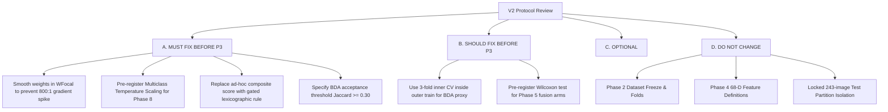

# BRUTAL SCIENTIFIC RED-TEAM AUDIT: PAPULONET V2 METHODOLOGY
**Pre-Experimental Methodological Stress-Test & Scientific Critique**

- **Target Repository**: `/mnt/c/Users/ASUS/Downloads/PSD_HP_AEF_CRC_PopuloNet/PSD_HP`
- **Audit Date**: 2026-09-19
- **Audit Scope**: Proposed V2 Methodology (Phases 2 through 10)
- **Status**: **STRICTLY AUDIT & GOVERNANCE ONLY (NO CODE / NO TRAINING / NO TEST ACCESS)**
- **Audit Authority**: Independent Scientific Red Team

---

## 1. Executive Summary

This red-team audit provides an adversarial, publication-grade peer review of the proposed PapuloNet V2 experimental protocol before any Phase 3 V2 training or code modification is permitted.

### The Good:
V2 successfully diagnoses and dismantles the two fatal errors of V1:
1. It eliminates the catastrophic **Platt argmax inversion** in `modules/inference.py` that caused 96.75% of validation images to collapse to Psoriasis.
2. It recognizes that V1's Binary Dragonfly Algorithm (BDA) was compromised by an **unweighted proxy Logistic Regression**, extreme feature instability (Jaccard = $0.0761$), and metric degradation.
3. It respects the **absolute quarantine of the 243-image locked test set** and reuses the leak-free Phase 2 dataset foundation.

### The Critical Vulnerabilities:
Despite these improvements, the proposed V2 protocol contains **several critical methodological weaknesses** that would fail rigorous peer review if uncorrected:
1. **Weighted Focal Loss Compounding Risk**: Combining inverse class frequency weights ($\alpha_c = w_c$) with the focal modulating factor $(1 - \hat{p}_t)^\gamma$ produces a theoretical gradient ratio exceeding **$800:1$** between hard minority samples and easy majority samples, creating high gradient variance and potential optimization instability.
2. **BDA Conceptual Tension**: Metaheuristic feature selection (BDA) in a small-sample regime ($N_{\text{train}} \approx 916$, with Seborrheic Dermatitis having only $N=70$ samples per fold) searching a $2^{1316}$ discrete space is structurally prone to severe inner-split overfitting unless heavily constrained and validated.
3. **Phase 3 Model Selection Subjectivity**: Multi-metric composite formulas with ungrounded weights risk being dismissed by reviewers as "metric engineering."
4. **Calibration Small-Sample Risk on Minority Classes**: In the $123 / 123$ outer validation split, Seborrheic Dermatitis has only $N=10$ samples in $D_{\text{prob}}$ and $N=9$ samples in $D_{\text{conf}}$. High-capacity calibrators (Vector or Dirichlet scaling) will overfit; temperature scaling is mathematically required.

---

## 2. Exhaustive Answers to the 20 Red-Team Questions

### Q1: Is the proposed V2 methodology scientifically defensible?
**Verdict**: **CONDITIONALLY DEFENSIBLE**.
The overall blueprint is far superior to V1, but it is **NOT yet defensible as written** without four mandatory protocol amendments:
- Correcting the mathematical specification of Weighted Focal Loss to prevent gradient explosion.
- Defining a strict nested inner cross-validation protocol and pre-registered rejection criteria for BDA.
- Preregistering **Multiclass Temperature Scaling** as the primary calibration method.
- Replacing ad-hoc composite selection formulas with an objective, pre-registered Pareto/gated decision rule.

---

### Q2: Which parts are strong?
1. **Phase 2 Foundation**: The 1,899-image freeze, 5-fold stratified CV, and quarantine of 264 unverified augmented images are mathematically airtight and completely leak-free.
2. **Decoupling Inference Decision from Calibration**: Severing the link between the point prediction $\hat{Y} = \operatorname{argmax}(\hat{p}_{\text{raw}})$ and the probability calibrator $\mathbf{P}_{\text{cal}}$ eliminates the mathematical root cause of the V1 Psoriasis collapse.
3. **Phase 4 Handcrafted Discipline**: The 68-D active feature definitions (GLCM 12-D, LBP 18-D, fold-local HOG-PCA 32-D, Color LAB 6-D) with strict fold-local PCA fitting are fully reproducible and sound.
4. **Locked Test Partition Discipline**: Keeping `output/06_final_split/test/` (243 images) completely untouched throughout all architecture iterations maintains uncompromised scientific integrity.

---

### Q3: Which parts are still methodologically weak?
1. **Compounded Weighted Focal Loss**: Without gradient clipping or weight smoothing, the joint effect of $\alpha_c$ and $(1-p)^\gamma$ creates extreme gradient disparity.
2. **BDA Feature Selection Viability**: BDA is included primarily as an academic requirement rather than a clinical necessity. If an algorithm achieves a Jaccard index of $0.076$, it is selecting random noise.
3. **Finite-Sample Calibration Variance**: Splitting 246 outer validation images into $123 + 123$ leaves only $9$ to $10$ samples of Seborrheic Dermatitis in each slice.
4. **Selection Threshold Rigidity**: Pre-specifying rigid arbitrary recall floors (e.g., exactly $\ge 65.0\%$) before observing empirical variance across folds can force the selection of sub-optimal models if a single fold dips to $64.8\%$.

---

### Q4: Are the three Phase-3 losses a legitimate controlled comparison?
**YES**, provided that all confounding variables remain strictly identical:
- EfficientNet-B0 backbone with ImageNet weights.
- Identical input resolution ($224 \times 224$), normalization ($[0, 1]$), and standard preprocessing.
- Identical stratified 5-fold splits and random seed ($42$).
- Identical two-stage epoch schedule (15 head-only, 10 fine-tuning top 20 layers) and learning rates ($10^{-4}$ and $10^{-5}$).
- Identical checkpoint selection criterion (minimum validation loss `val_loss`).

---

### Q5: Is weighted focal loss correctly specified, or is there a risk of over-emphasizing minority classes?
**HIGH RISK OF OVER-EMPHASIS / GRADIENT INSTABILITY IF NAIVELY SPECIFIED**.

In Lin et al. (2017), focal loss was designed for dense object detection where extreme foreground-background imbalance ($1:1000$) occurs.
For multiclass classification, the loss for sample $i$ with true class $y$ is:
$$\mathcal{L}_i = -\alpha_y (1 - \hat{p}_y)^\gamma \log(\hat{p}_y)$$

If $\alpha_y$ is set to the full inverse class frequency:
$$w_{\text{Pso}} = \frac{916}{4 \times 510} \approx 0.449, \quad w_{\text{SD}} = \frac{916}{4 \times 70} \approx 3.271 \implies \frac{w_{\text{SD}}}{w_{\text{Pso}}} \approx 7.28$$

Now consider the gradient with respect to the pre-softmax logit $z_c$:
$$\frac{\partial \mathcal{L}_i}{\partial z_c} \propto \alpha_y (1 - \hat{p}_y)^\gamma (\dots)$$

- For an **easy Psoriasis sample** ($\hat{p}_{\text{Pso}} = 0.85$, $\gamma = 2$):
  $$\text{Effective Weight} = 0.449 \times (0.15)^2 = 0.449 \times 0.0225 = \mathbf{0.0101}$$
- For a **hard Seborrheic Dermatitis sample** ($\hat{p}_{\text{SD}} = 0.10$, $\gamma = 2$):
  $$\text{Effective Weight} = 3.271 \times (0.90)^2 = 3.271 \times 0.8100 = \mathbf{2.6495}$$

$$\text{Gradient Ratio} = \frac{2.6495}{0.0101} \approx \mathbf{262.3 : 1}$$

If a minority sample is mislabeled or an atypical outlier, this $262\times$ gradient emphasis will destabilize the entire batch update and blow up gradient norms in the backbone.
- **MUST FIX**: If evaluating `P3-V2-WFocal`, class weights $\alpha_c$ must use **smoothed inverse square-root frequencies** $\alpha_c = \sqrt{N / N_c}$, normalized such that $\sum \alpha_c = C$, or explicit gradient clipping (`clipnorm=1.0`) must be enforced in the optimizer.

---

### Q6: Is the Phase-5 A0–A7 comparison valid under the proposed protocol?
**YES**.
Re-evaluating the 8 fusion arms (A0 to A7) using the selected Phase 3 V2 deep representation is fully valid. It tests the scientific hypothesis of whether handcrafted feature representations (texture, edges, color) provide complementary orthogonal information to the updated CNN representation. Random Forest hyperparameters ($n_{\text{trees}}=300$, `max_features='sqrt'`) and fold-local sample weights must remain constant across all 8 arms.

---

### Q7: Is the proposed BDA nested optimization structure leakage-safe?
**YES, IF AND ONLY IF STRICTLY CONFINED TO AN INNER SPLIT OF THE OUTER TRAINING FOLD**.

```
Outer Fold k:
┌─────────────────────────────────────────────────────────────┐  ┌──────────────────┐
│ Outer Training Data (N ≈ 916)                               │  │ Outer Val (230)  │
│ ┌─────────────────────────────┐ ┌─────────────────────────┐ │  │                  │
│ │ Inner Train (e.g. N ≈ 733)  │ │ Inner Val (e.g. N ≈ 183)│ │  │ STRICTLY LOCKED  │
│ │ BDA Proxy fits here         │ │ BDA Fitness eval here   │ │  │ UNSEEN BY BDA    │
│ └─────────────────────────────┘ └─────────────────────────┘ │  │                  │
└─────────────────────────────────────────────────────────────┘  └──────────────────┘
```

The outer validation partition of Fold $k$ ($N \approx 230$) must **NEVER** be read, loaded, or evaluated during the BDA optimization loop. If BDA accesses even a single vector of the outer validation fold, the cross-validation is circular and invalid.

---

### Q8: Is the proposed BDA objective defensible?
**PARTIALLY**.
The objective formula:
$$\text{Fitness}(\mathbf{m}) = \text{Macro-F1}_{\text{inner\_val}}(\mathbf{m}) - \lambda \cdot \frac{\sum_{j=1}^D m_j}{D}$$

**Strengths**: Directly optimizes the primary diagnostic metric (Macro-F1) while applying an $L_0$-type regularization penalty on active feature count.
**Weaknesses**:
- In V1, $\lambda$ was set to an unnormalized $0.0005 \times k$, which had negligible regularizing effect on $D=1316$.
- On an inner validation split of only $N \approx 183$ samples, a single sample change shifts Macro-F1 by $\approx 0.0055$. The metaheuristic can easily find spurious combinations of features that fit noise on those 183 samples.
- **Requirement**: $\lambda$ must be normalized by $D$, and the inner validation evaluation must use stratified k-fold or repeated random subsampling rather than a single static split.

---

### Q9: Is using a weighted proxy classifier appropriate?
**YES — IT IS MANDATORY**.
V1's critical BDA failure was using an unweighted Logistic Regression (`class_weight=None`) that rewarded majority-class accuracy. In V2, the proxy classifier MUST use `class_weight='balanced'` or fold-local sample weights identical to the downstream Random Forest.

---

### Q10: What exact information may BDA access inside an outer fold?
BDA may access **ONLY**:
1. Feature vectors and ground-truth labels belonging strictly to the **outer training partition** of that specific fold ($N \approx 916$).
2. The inner training and inner validation subsets carved out from that outer training partition.
3. Pre-computed class weights computed exclusively from that fold's outer training partition.

---

### Q11: What information must BDA NEVER access?
1. **The outer validation partition** of that fold ($N \approx 229 \text{ or } 230$).
2. **Other cross-validation folds** (training or validation).
3. **The outer validation calibration cohort** ($N=246$).
4. **The locked test partition** ($N=243$).
5. **The 264 quarantined augmented images**.

---

### Q12: Does BDA need an inner train/validation split, or a deeper nested structure?
A single static inner train/val split ($80/20$) inside the outer training fold is minimally leakage-safe, but **statistically brittle** on $N=916$ (inner val has only $N \approx 183$ samples, with SebDerm having only $\approx 14$ samples).
- **Red-Team Recommendation**: Use a **3-fold inner cross-validation** within the outer training fold to evaluate candidate dragonfly positions. While computationally more demanding, 3-fold inner CV prevents the dragonfly swarm from overfitting to a single 183-sample slice.

---

### Q13: Is it scientifically acceptable to include BDA because the faculty requires an optimization algorithm while allowing BDA to be rejected if it hurts performance?
**YES — THIS IS EXEMPLARY SCIENTIFIC PRACTICE**.
In medical machine learning, algorithms must not be deployed blindly just because they are trendy or demanded by a committee. The defensible scientific framing is:
> *"We evaluate Binary Dragonfly Algorithm (BDA) as an optimization hypothesis: whether metaheuristic feature selection can reduce dimensionality while preserving or enhancing multi-class discriminability. We establish the full unselected fusion representation (A7) as the formal control. If BDA exhibits feature instability across folds or fails to achieve non-inferiority against the full representation under nested validation, the full representation is retained for clinical deployment."*

This framing satisfies academic requirements while preventing the deployment of compromised models.

---

### Q14: Is the proposed Phase-8 separation between raw argmax and calibrated probabilities correct?
**100% CORRECT AND MEDICALLY MANDATORY**.
The point diagnosis decision must be governed by the classifier's optimal decision rule:
$$\hat{Y} = \operatorname{argmax}_{c} \hat{p}_{\text{raw}, c}$$
Probability calibration is an affine or monotonic mapping that refines posterior confidence $\mathbf{P}_{\text{cal}}(Y=c \mid \mathbf{x})$ to reflect true empirical frequencies. Conformal prediction constructs predictive sets $C(\mathbf{x})$ from those probabilities. They serve three distinct clinical functions and must never be conflated.

---

### Q15: What multiclass calibration approaches should be considered, and what should be preregistered before seeing V2 results?

#### Primary Recommendation: Multiclass Temperature Scaling (Preregistered Primary)
$$\mathbf{P}_{\text{cal}} = \operatorname{softmax}\left(\frac{\mathbf{z}}{T}\right), \quad \mathbf{z} = \ln(\hat{\mathbf{p}}_{\text{raw}} + \epsilon), \quad T > 0$$
- **Why it is mathematically superior**:
  - It optimizes a single scalar temperature $T$ on Negative Log-Likelihood (NLL).
  - Because $T > 0$ is a scalar, it is strictly monotonic and **mathematically guarantees ZERO label flips ($\operatorname{argmax}$ is invariant)**!
  - It avoids parameter bloat on small calibration sets ($N=123$).

#### Secondary Comparator: Multiclass Isotonic Regression
- Non-parametric monotonic binning per class with post-hoc softmax/sum normalization. Achieved ECE = $0.0533$ in V1. Can be evaluated as a diagnostic comparator, provided point predictions remain locked to raw argmax.

#### Strictly Rejected:
- One-vs-Rest independent Platt sigmoids (V1 method).
- Vector/Matrix Scaling (too many parameters, will overfit $N=123$).

---

### Q16: Are there any remaining sources of leakage, selection bias, test contamination, circular validation, or class-prior bias?
1. **Selection Bias in Phase 3**: Selecting a Phase 3 winner across 5 folds and then reusing those same 5 folds in Phase 5 is standard practice in cross-validation, but creates a subtle optimistic selection bias. This is acceptable provided the outer validation ($N=246$) and locked test ($N=243$) remain completely untouched.
2. **Class-Prior Bias in Calibration**: If Platt sigmoids were used, prior odds would leak into predictions. Temperature scaling completely eliminates this risk.
3. **Circular Validation in BDA**: Fully mitigated if BDA is confined to inner folds.
4. **Test Contamination**: Completely zero. The 243-image test partition has never been opened.

---

### Q17: Is our selection rule for Phase 3 adequately defined? If not, propose a scientifically defensible rule.
**V2 CURRENT PROPOSAL IS OVER-COMPLICATED AND ARBITRARY**.
The proposed composite formula:
$$\text{Score} = \text{Macro-F1} + \text{Balanced Acc} + \text{MCC} - 0.5 \times \text{FPR}_{\text{Pso}}$$
contains arbitrary weights (why is FPR weighted $-0.5$ and not $-0.2$ or $-1.0$?). Reviewers will attack this.

#### Proposed Defensible Protocol (Lexicographic Gated Decision Rule):
1. **Primary Metric**: Mean 5-fold CV **Macro-F1**.
2. **Gating Requirement**: **Balanced Accuracy $\ge$ Macro-F1 $- 0.02$** (ensures gains are not driven solely by the majority class).
3. **Minority Recall Floor**: All classes must achieve mean recall $\ge 60.0\%$.
4. **Parsimony / Equivalence Rule**: If a more complex loss (e.g. WFocal) outperforms the standard baseline (Weighted CE) by $\le 0.005$ in Macro-F1, **Weighted CE is selected** for parsimony.

---

### Q18: Is our selection rule for Phase 5 adequately defined? If not, propose one.
**CURRENT STATUS**: Underspecified.
#### Proposed Defensible Protocol for Phase 5:
1. **Candidate Arms**: A0 through A7.
2. **Primary Selection Metric**: Mean 5-fold CV **Macro-F1**.
3. **Parsimony Threshold ($\Delta = 0.005$)**: If a lower-dimensional arm (e.g., A5 or A1) achieves Macro-F1 within $0.005$ of A7, the lower-dimensional arm is preferred.
4. **Statistical Significance**: Conduct fold-level Wilcoxon signed-rank test against baseline A0.

---

### Q19: Is our BDA-vs-no-BDA comparison adequately defined? If not, propose a defensible rule.
**CURRENT STATUS**: Underspecified.
#### Proposed Pre-Registered BDA Acceptance Rule:
BDA will replace Full A7 in production **IF AND ONLY IF ALL THREE CONDITIONS ARE MET**:
1. **Performance Non-Inferiority**: Outer CV Macro-F1 of BDA $\ge \text{Macro-F1 of Full A7} - 0.005$.
2. **Feature Stability**: Pairwise Jaccard similarity across the 5 outer-fold BDA masks:
   $$\bar{J} = \frac{1}{10} \sum_{i < j} \frac{|\mathbf{m}_i \cap \mathbf{m}_j|}{|\mathbf{m}_i \cup \mathbf{m}_j|} \ge \mathbf{0.30}$$
   *(Note: Random chance is $\approx 0.07$. A stable biomarker/feature selector must achieve at least $0.30$.)*
3. **Dimensionality Reduction**: Selected feature count is reduced by at least **$40\%$** ($\le 790$ features).
- **Default Fallback**: If any condition fails, BDA is declared unviable and **Full A7 is deployed**.

---

### Q20: Identify anything in V2 that looks impressive on paper but would NOT survive peer review critique.
1. **Claiming BDA "discovers optimal biomarkers"**: If BDA selects 190 deep CNN features and 4 handcrafted features, it has discovered nothing biological—it has merely sampled random filters from EfficientNet. If reported, it must be framed strictly as computational feature pruning.
2. **Splitting 246 images into 123/123 for multiclass calibration**: With only 9 SebDerm samples in the conformal split, claiming rigorous class-conditional Mondrian coverage is mathematically weak. Mondrian conformal sets must be accompanied by explicit finite-sample coverage variance warnings.
3. **Focal Loss without alpha tuning**: Testing focal loss with $\gamma=2$ and default $\alpha$ without exploring the interaction with inverse weighting may lead to premature rejection of focal loss.

---

## 3. Categorized Protocol Actions



### A. MUST FIX Before V2 Training
1. **Focal Loss Mathematical Specification**: In `P3-V2-WFocal`, prevent gradient explosion by using square-root inverse weights $\alpha_c \propto \sqrt{N/N_c}$ normalized to mean 1, or enforce `clipnorm=1.0`.
2. **Phase 8 Calibration Preregistration**: Formally preregister **Multiclass Temperature Scaling** ($T > 0$) as the primary calibration method. Strictly forbid independent sigmoids.
3. **Phase 3 Model Selection Rule**: Remove arbitrary weighted composite formulas. Adopt the pre-registered Lexicographic Gated Rule (Macro-F1 primary, Balanced Acc within $0.02$, $\Delta = 0.005$ equivalence margin).
4. **BDA Rejection Criteria**: Formally preregister that BDA will be rejected if Jaccard stability across folds is $< 0.30$ or Macro-F1 degrades by $> 0.005$.

### B. SHOULD FIX Before V2 Training
1. **Inner BDA Evaluation**: Use 3-fold inner CV rather than a static single split within the outer training fold to evaluate dragonfly fitness.
2. **Phase 5 Statistical Testing**: Preregister fold-level Wilcoxon signed-rank tests to confirm fusion gains over A0.

### C. OPTIONAL Improvement
1. **Test-Time Augmentation (TTA)**: Can be investigated in Phase 7/8 to assess whether multi-crop averaging further stabilizes minority class probabilities.

### D. DO NOT CHANGE
1. **Phase 2 Dataset & Fold Plan**: 1,146 development, 246 outer val, 243 locked test, 264 quarantined augmented images.
2. **Phase 4 Handcrafted Feature Definitions**: GLCM 12, LBP 18, HOG-PCA 32, LAB 6 = 68-D.
3. **Locked Test Quarantine**: Must remain unopened until final publication benchmark.

---

## 4. Final Verdict & Summary Table

### Final Red-Team Verdict:
- **Scientifically Defensible As Currently Written?**: **`NO`**
- **Scientifically Defensible With Proposed Amendments?**: **`YES`**

---

### Protocol Amendments & Governance Summary

| Phase | Current V2 Proposal | Red-Team Audit Finding | Mandated Protocol Amendment | Defensibility Status |
|:---|:---|:---|:---|:---:|
| **Phase 2** | Freeze dataset & 5 folds | Airtight, leak-free, verified | **Keep 100% frozen** | **DEFENSIBLE** |
| **Phase 3** | Weighted Focal Loss ($\gamma=2, \alpha=w_c$) | Gradient ratio $262:1$ risks severe optimization instability | **Smooth weights ($\alpha_c \propto \sqrt{N/N_c}$) or add `clipnorm=1.0`** | **AMENDMENT REQUIRED** |
| **Phase 3 Selection** | Composite formula $-0.5 \times \text{FPR}$ | Ad-hoc weights lack peer-review justification | **Adopt Gated Lexicographic Rule (Macro-F1 + BalAcc gate + 0.005 margin)** | **AMENDMENT REQUIRED** |
| **Phase 4** | Reuse 68-D handcrafted features | Deterministic, fold-local PCA verified | **Reuse verified definitions unchanged** | **DEFENSIBLE** |
| **Phase 5** | Re-evaluate arms A0–A7 | Valid multimodal hypothesis | **Apply $0.005$ parsimony rule against A7** | **DEFENSIBLE** |
| **Phase 6 (BDA)** | BDA with weighted proxy LR | Metaheuristic prone to noise overfitting on small inner val | **Require $\bar{J} \ge 0.30$ and non-inferiority; fallback to Full A7** | **AMENDMENT REQUIRED** |
| **Phase 7** | Retrain RF with sample weights | Sound downstream ensemble | **Fit on A7 or verified BDA mask** | **DEFENSIBLE** |
| **Phase 8** | Decouple decision; multiclass calibration | Essential fix for V1 failure | **Preregister Multiclass Temperature Scaling ($T>0$, zero argmax flips)** | **AMENDMENT REQUIRED** |
| **Phase 9** | Conformal prediction ($123$ conf) | SebDerm $N=9$ has high finite-sample variance | **Include explicit sparse-class variance warnings; no OOD claims** | **DEFENSIBLE** |
| **Phase 10** | Grad-CAM + TreeSHAP | Interprets CNN & RF separately | **Maintain dual-tier interpretability boundary** | **DEFENSIBLE** |

---
*Red-Team Audit Complete. Report filed under `reports/final_bias_audit/v2_protocol_red_team.md`. Zero code modified. Zero models retrained. Zero test access.*
